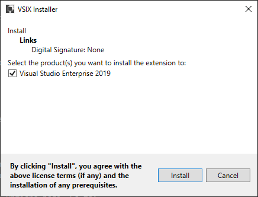
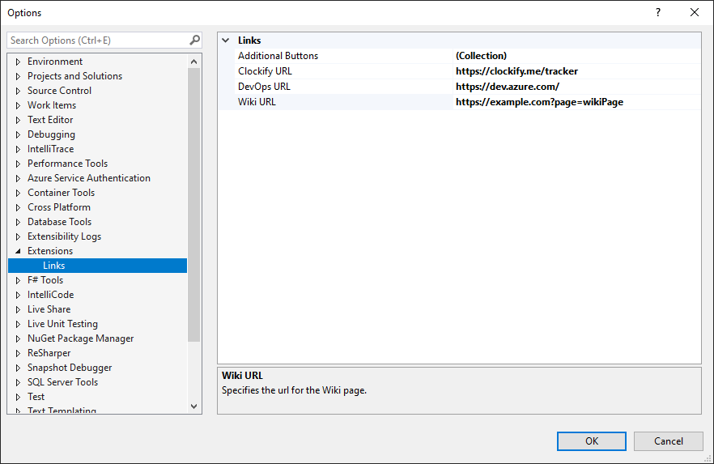

# Links

## Introduction 
`Links` is a VSIX project that contains the [Visual Studio](https://visualstudio.microsoft.com/vs/) Extension which serves as a quick access to websites of interest.

## Installation
To be able to install the extension on your own machine, you first need to have [Visual Studio 2019](https://visualstudio.microsoft.com/vs/) or newer installed. Then you need to build it and run the generated `Enterwell.VS.Links.vsix` file in the `bin\(Debug|Release)` folder. 

Installer will pop up showing the extension name asking to which installed Visual Studio product you want to install the extension to.

## Usage
Extension is always visible in the standard toolbar at the end in the form of Menu Controller.

By default, there are 3 standard working-out-of-the-box buttons that take the user to their respective websites:

+ Enterwell's Wiki
+ Enterwell's default Azure DevOps page
+ Clockify used by Enterwell to track hours on different projects

  

**Additional Buttons** button servers only as a placeholder for further configuration. It does nothing by itself. It is separated from the default buttons with a divider.

It is possible to extend and configure the URLs in the Options page. Go to:

+ **Tools -> Options..**
+ In the Options page find the **Extensions** category
+ Inside of the category, **Enterwell Links** page is placed

  

  Here, developer can change the target URLs for the three default buttons and also assign **Additional Buttons** if needed.

+ If the developer wants to add new buttons, by opening the **Additional Buttons** collection, he can *add*, *remove*, *delete* or *rearrange* the additional buttons.

  

By saving the options, extension's Menu Controller is automatically updated to reflect new settings. Notice that the placeholder button is now removed.

# Development
In order to be able to run this code on your machine, you need to have:
1. [Visual Studio 2019](https://visualstudio.microsoft.com/vs/) or newer
2. Visual Studio extension development toolset from the Visual Studio Installer

   
